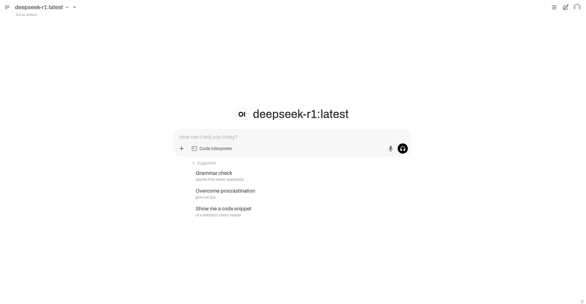

# DeepSeek R1 

## 1. 安装 Docker

### Windows 安装
1. 下载 Docker Desktop for Windows：
   - 访问 [Docker 官网](https://www.docker.com/products/docker-desktop)
   - 下载 Docker Desktop Installer.exe
2. 运行安装程序
3. 安装完成后，启动 Docker Desktop
4. 在系统托盘中可以看到 Docker 图标

### Linux 安装
```bash
# 更新包索引
sudo apt-get update

# Add Docker's official GPG key:
sudo apt-get update
sudo apt-get install ca-certificates curl
sudo install -m 0755 -d /etc/apt/keyrings
sudo curl -fsSL https://download.docker.com/linux/ubuntu/gpg -o /etc/apt/keyrings/docker.asc
sudo chmod a+r /etc/apt/keyrings/docker.asc

# Add the repository to Apt sources:
echo \
  "deb [arch=$(dpkg --print-architecture) signed-by=/etc/apt/keyrings/docker.asc] https://download.docker.com/linux/ubuntu \
  $(. /etc/os-release && echo "${UBUNTU_CODENAME:-$VERSION_CODENAME}") stable" | \
  sudo tee /etc/apt/sources.list.d/docker.list > /dev/null
sudo apt-get update

# Install the Docker packages
sudo apt-get install docker-ce docker-ce-cli containerd.io docker-compose-plugin
```

### macOS 安装
1. 下载 Docker Desktop for Mac
2. 双击 Docker.dmg 运行安装程序
3. 将 Docker 拖到 Applications 文件夹
4. 从 Applications 文件夹启动 Docker

## 2. 安装 Docker Compose

在 Windows 和 macOS 上，Docker Compose 已经包含在 Docker Desktop 中。

对于 Linux：
```bash
sudo apt-get install docker-compose-plugin
```

## 3. 验证安装

```bash
# 检查 Docker 版本
docker --version

# 检查 Docker Compose 版本
docker-compose --version
```


### 示例说明
以您提供的 docker-compose.yml 为例 (GPU Version)，这是一个运行 Ollama（AI 模型服务）和 Open WebUI 的配置：

```yaml
services:
  # Ollama 服务配置
  ollama:
    image: ollama/ollama:latest    # 使用最新的 Ollama 镜像
    container_name: ollama         # 容器名称
    user: root                     # 以 root 用户运行
    volumes:
      - ollama:/root/.ollama       
    ports:
      - "11434:11434"              # 端口映射
    restart: unless-stopped        
    deploy:
      resources:
        reservations:
          devices:
            - driver: nvidia       # GPU 支持配置
              count: all
              capabilities: [gpu]

  # Open WebUI 服务配置
  open-webui:
    image: ghcr.io/open-webui/open-webui:main
    container_name: open-webui
    volumes:
      - open-webui:/app/backend/data
    ports:
      - "3000:8080"                
    extra_hosts:
      - "host.docker.internal:host-gateway"
    restart: unless-stopped
    depends_on:
      - ollama                    

# 定义持久化卷
volumes:
  ollama:
  open-webui:
```

### 启动服务 (GPU)
1. 将 docker-compose.yml 保存到某个目录
2. 在该目录下运行：
```bash
sudo docker compose up -d
sudo docker exec -it ollama ollama pull deepseek-r1
```

### 启动服务 (CPU)
1. 将 docker-compose.cpu.yml 保存到某个目录
2. 在该目录下运行：
```bash
sudo docker compose -f docker-compose.cpu.yml up -d
sudo docker exec -it ollama ollama pull deepseek-r1
```
### 访问服务：
- Open WebUI 界面：http://localhost:3000

